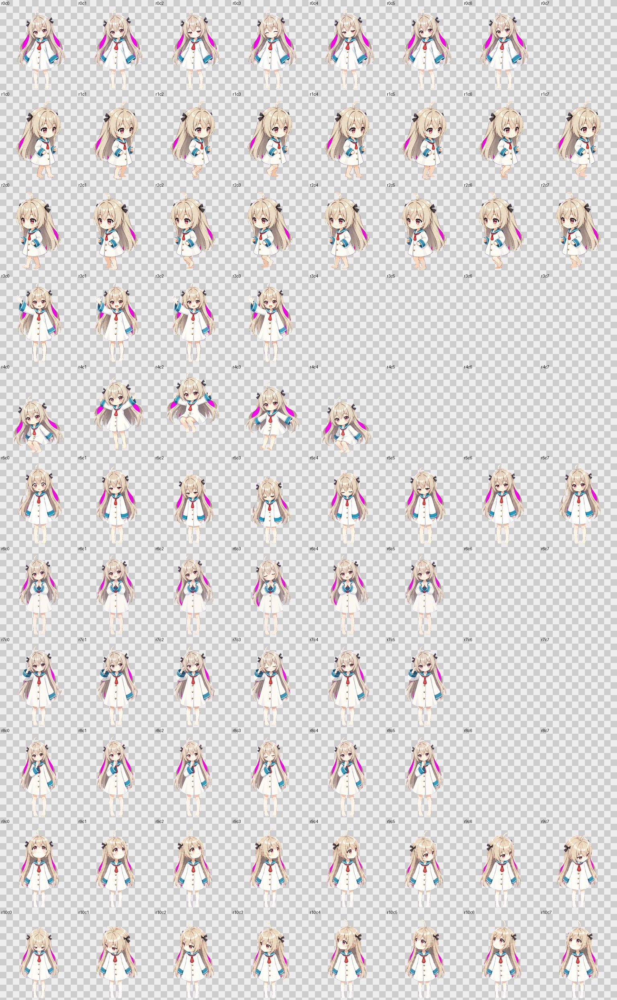

# CodeX HatchPet ATRI

A Codex-compatible v2 animated desktop pet inspired by ATRI from *ATRI -My Dear Moments-*.
The current atlas uses one consistent chibi model across all actions. The run keeps a fixed upper
body and performs two compact alternating steps; the left cycle is an exact whole-frame mirror, so
body direction, anatomy, and the warm near/far-leg shading always turn together.



## Package

The installable pet is in [`pet/`](pet/):

- `pet.json` declares `spriteVersionNumber: 2`.
- `spritesheet.webp` is a transparent `1536 × 2288` atlas using `192 × 208` cells.
- Rows 0–8 contain the nine standard Codex animation states.
- Rows 9–10 contain 16 clockwise look directions.

## Install

Copy the package into your Codex pet directory:

```bash
mkdir -p ~/.codex/pets/atri
cp pet/pet.json ~/.codex/pets/atri/pet.json
cp pet/spritesheet.webp ~/.codex/pets/atri/spritesheet.webp
```

Restart Codex if the pet does not appear immediately.

## Validation

The [`qa/`](qa/) folder contains the character brief, action mechanics, v2 atlas validator,
chroma/alpha report, direction semantics, continuity measurements, full visual review sheets, and a
manual motion-review manifest bound to the exact atlas SHA-256.

Run the complete structural validator with:

```bash
python3 qa/validate_pet_atlas.py pet/spritesheet.webp
```

Deterministic validation confirms:

- atlas dimensions: `1536 × 2288`
- layout: 8 columns × 11 rows
- sprite contract: v2
- transparent RGB residue: 0 pixels
- complete connected character anatomy in every used frame
- a compact two-step jog: four contact/passing/lift poses, then the same poses with the anatomical
  near/far legs exchanged
- exact whole-frame left/right running mirrors with preserved temporal order and leg shading
- run torso drift of `0.057 px` horizontally and `1.234 px` vertically
- adjacent run silhouette IoU of `0.921–0.952` and a maximum warm-leg span of `43 px`
- zero cool purple/blue pixels in every running-leg region
- coherent crouch/launch/vertical-tuck-apex/descent/landing-absorption physics
- exact unshifted look mirrors and a continuous clockwise 16-direction loop
- SHA-bound native-size and enlarged frame-strip review of every action
- no structural validation errors

## Character and rights notice

ATRI and *ATRI -My Dear Moments-* are properties of their respective rights holders. This repository is an unofficial, noncommercial fan project. It is not affiliated with or endorsed by Aniplex, Frontwing, Makura, or the official production committee.

The included pet artwork was generated specifically for this project from original prompts and
temporary visual references; it is not extracted from official artwork. Do not use it commercially or
represent it as official artwork.
